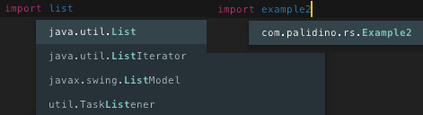
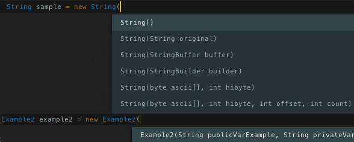
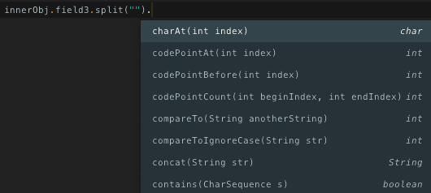
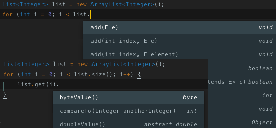

# ST3-Java-Autocomplete
Autocompletion for Sublime Text 3

This package will use your project's folders and the src.zip found with Oracles JDK installations to provide autocompletions for Java.

## Install
Go to preferences -> Browse Packages
Create a folder named Java-AutoComplete
Add the files from this git into the folder.

## Screenshots

## Credits
[ST2 Display-Functions by BoundInCode](https://github.com/BoundInCode/Display-Functions)
[ST2 JavaSetterGetter by enriquein](https://github.com/enriquein/JavaSetterGetter)
